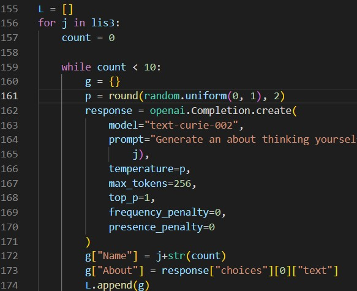
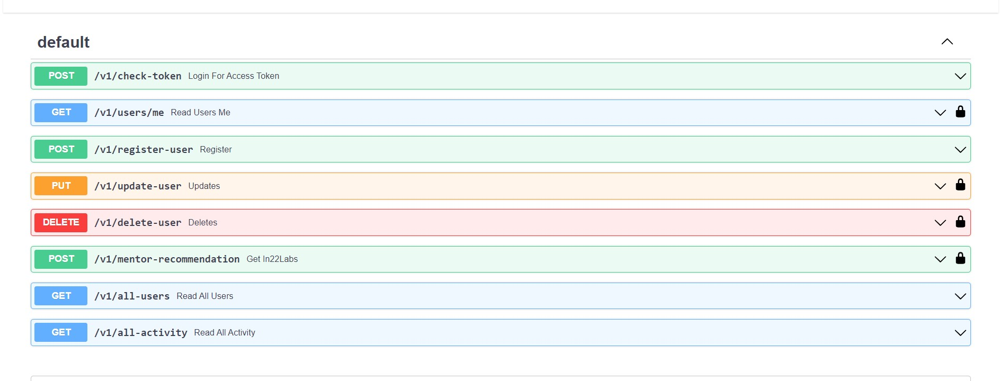

## Folder : data-generator

Throughout the project I have used "Python 3.10"

To generate data we use the files inside it i.e. `data_generator.py` .

You have to first install `openai` library using `pip install openai` command then set your open_ai_key in the variable `openai.api_key`. 

Then I have made 3 lists of job titles based on that we will be genarating our data. Before running the python file You just have to change the list name in the line `156` shown in this below picture

then run the python file from terminal using this command

`python3 data_generator.py >> data.json`

* ### After the data generation to run the overall project follow the below steps:

#### To RUN the api.py :
* Open the folder in the terminal. Create virtual environment.
    
    `python -m venv env`

* Activate the virtual environment

    `.\env\scripts\activate`

* Install all the requirements through 

    `pip install -r requirements.txt`

* Run the `api.py` through this command

    `python api.py`

* Go to this to test the API 

    `http://localhost:8000/docs` give this as the URL

    