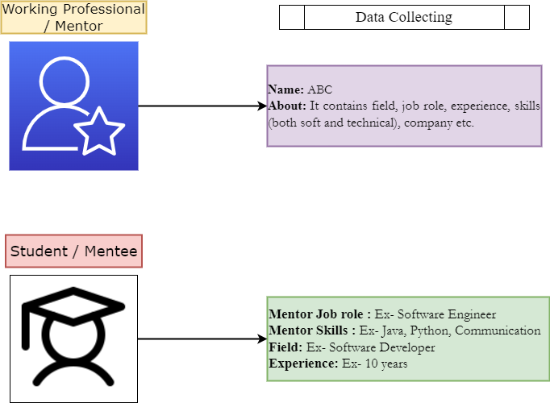
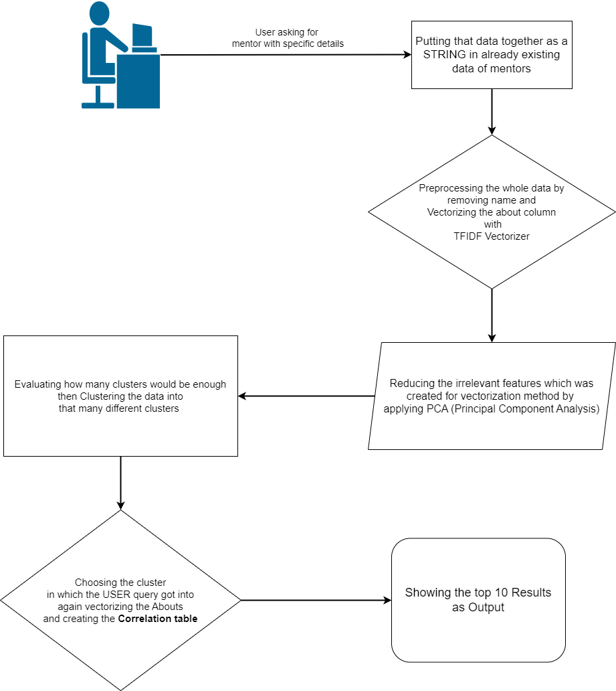

# Mentor-Mentee Matchmaking 

### 
 ~ *Dibyendu Laha, In22Labs* 

-----------------------------------------------------------------

`predict.py` contains the code for making the cluster and predicting the closest match

`user_db.py` contains the code to write the query and response to DB

`security_token.py` contains the code to create JWT token

`config_db.ini` contains the postgres database credentials

`config.ini` contains the fast api host credentials

* ## Data Generation :

    To generate synthetic data of mentors we are taking help from Chat GPT Open Ai platform from which we first generated nearly 145 job field of current era. Then using custom code ( available at `data_generator.py` ) and randomization we are creating 10 about for an experienced working professional for one job field. Through this way we have created 1450 profile which is available at `data.json`.

* ## Features Selection :
   
    * Data from mentor which contains experience, field, job role, skills etc.
    * Getting query from mentee which will contain Mentor job role, field and experience needed.
    
#

* ## Data transformation & the WorkFlow :
#

## To RUN the api.py :
* Open the folder in the terminal. Create virtual environment.
    
    `python -m venv env`

* Activate the virtual environment

    `.\env\scripts\activate`

* Install all the requirements through 

    `pip install -r requirements.txt`

* Run the `api.py` through this command

    `python api.py`

* Go to this to test the API 

    `http://localhost:8000/docs` give this as the URL

    

## Future Enhancements :

- Need to create Classification model with existing structured data.
- Need to use real structured data instead of synthetic data and integrate frontend.